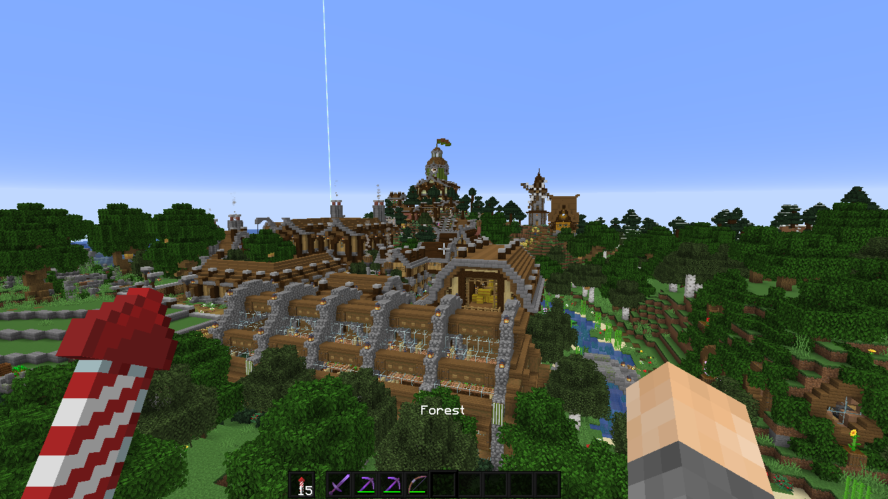
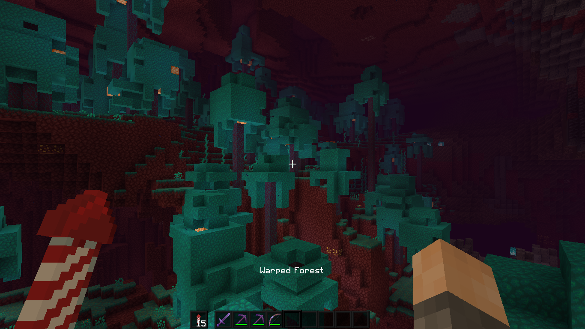
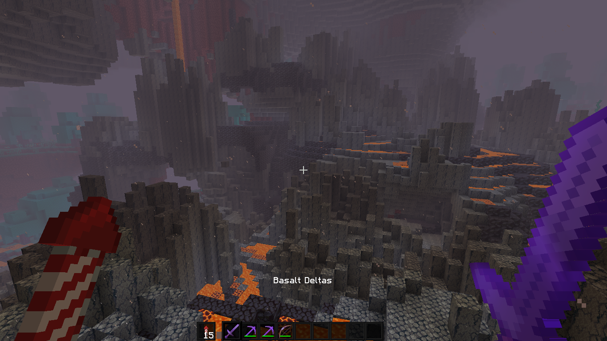
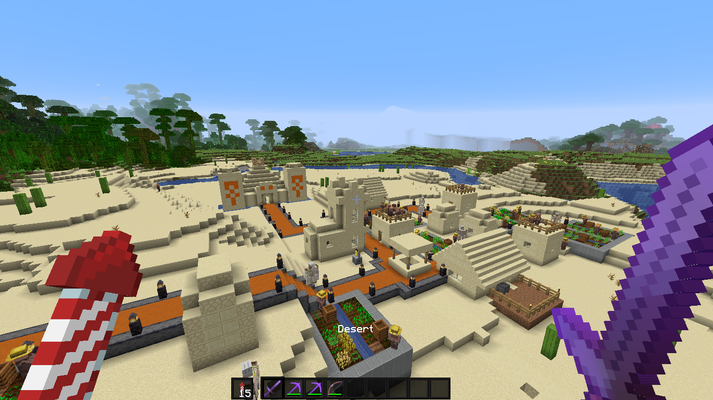

# biome_display

Displays the name of the biome the player is currently in on the HUD.
Works across all dimensions, and supports all biomes as of 1.18.

Put the .zip in `~/.minecraft/saves/name-of-world/datapacks`

### *1.0.0 (01/15/2022)*
------------------------
- Major rework, since it hasn't worked since 1.17.
- Now suports 1.18.1 and all the new biomes.

### *0.0.4 (08/12/2020)*
------------------------
- Pack format 6 (1.16.2+)

### *0.0.3 (06/29/2020)*
------------------------
- Added support for multiplayer servers.

### *0.0.2 (06/02/2020)*
------------------------
- **Due to a bug in Snapshot 20w22a, datapacks are not reloaded correctly when a world is opened. You will need to manually run `/reload` after opening your world to make the datapack run. (This bug is fixed as of 1.16 pre1. For future reference, here is the bug in question: https://bugs.mojang.com/browse/MC-186478)**
- Fixed some misnamed tags preventing the datapack from loading.
- Added startup message.
- Added a few screenshots.

### *0.0.1 (05/31/2020)*
------------------------
- Initial version: works in singleplayer mode only

### Screenshots
----------------------

